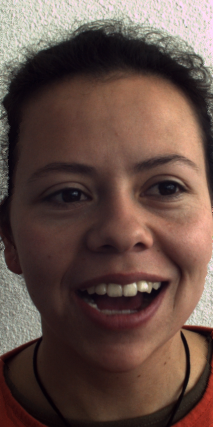
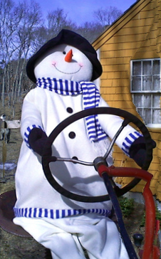

### Adaptive Seam Carving Application

#### Overview

This application is a seam carving tool that allows users to remove vertical seams from an image to reduce its width. The app uses various image processing techniques to calculate energy maps and determine which seams to remove, enhancing image retargeting. The seam carving process takes into account the image's saliency, depth gradient, and entropy maps.

### Key Features

1. **Energy Calculation**: Computes an energy map based on edge detection, saliency, depth, and entropy maps to guide seam removal.
2. **Seam Finding and Removal**: Identifies and removes the lowest energy seams iteratively.
3. **Seam Visualization**: Highlights seams on the image during the carving process for visualization.
4. **Graphical User Interface (GUI)**: A Tkinter-based GUI for user interaction, allowing easy input of parameters and real-time progress updates.

### Dependencies

- OpenCV
- NumPy
- scikit-image
- Tkinter
- Pillow

### Installation

1. **Clone the repository**:
   ```bash
   git clone <repository_url>
   cd <repository_directory>
   ```

2. **Install required Python packages**:
   ```bash
   pip install opencv-python-headless numpy scikit-image pillow
   ```

3. **Sample Dataset**:
   In the Samples dataset folder, each subfolder should be named according to the image category (e.g., Diana). Each subfolder should contain the saliency map and depth map for the corresponding images.

### Usage

1. **Run the Application**:
   ```bash
   python seam_carving_app.py
   ```

2. **GUI Interaction**:
   - **Enter Category**: Input the image category (e.g., Diana, Baby, Snowman).
   - **Number of Columns to Delete**: Specify the number of vertical seams (columns) to remove.
   - **Start Seam Carving**: Click the button to begin the process.

3. **Output**:
   - The application will display the image with highlighted seams during the process.
   - Upon completion, the output image will be saved to the specified directory.

### Energy Calculation Details

In the `calculate_energy` function, we compute the energy map for seam carving using several steps:

1. **Gradient Map Calculation**: Compute the gradient map of the image.
   - Split the gradient map into smaller blocks.
   - Calculate the average luminance level for each block.
   - Sort the blocks based on their average luminance levels and select the top 87 highest values.
   - Multiply the pixels in these blocks by a constant factor of 4.5.

2. **Entropy and Depth Maps**:
   - Calculate the average luminance level for each block in the depth map and the entropy map.
   - Compute the overall mean luminance for all blocks in both maps.
   - Iterate through the blocks in the entropy map. For blocks where the average depth is below the overall mean depth and the average entropy is above the overall mean entropy, multiply the pixels by a constant factor of 2. This adjustment is made because these regions are considered less important.

   ```python
   if avg_depth_blocks[i, j] < overall_mean_depth and overall_mean_entropy < avg_entropy_blocks[i, j]:
       block = entropy_energy_normalized[i*block_size_y:(i+1)*block_size_y, j*block_size_x:(j+1)*block_size_x]
       adjusted_entropy[i*block_size_y:(i+1)*block_size_y, j*block_size_x:(j+1)*block_size_x] = 2 * block
   ```

3. **Saliency Map**:
   - Similar to the gradient map, calculate the saliency map and split it into blocks.
   - Select the top 120 blocks based on their luminance levels and multiply the pixels in these blocks by a factor of 1.5.

4. **Depth Map**:
   - Apply an Otsu thresholding method to the depth map.
   - Multiply the pixels that exceed the Otsu threshold by a factor of 7.

5. **Combining Energy Maps**:
   - Finally, combine the adjusted energy maps using specific weights:

   ```python
   energy_combined = (
       1.0 * adjusted_energy_edge +               
       1.0 * adjusted_saliency_map +              
       1.0 * adjusted_depth_map  +               
       0.5 * -adjusted_entropy                          
   )
   ```

### Results

#### Original and 50% Decrease in Width

1. **Diana**

   - **Original**:
     
   - **50% Decrease**:
     

2. **Snowman**

   - **Original**:
     
   - **50% Decrease**:
     
